http://www.cnblogs.com/feixuelove1009/p/5823135.html

## 2.创建Django项目

采用国际惯例的项目名称mysite

Django自动生成的目录结构：

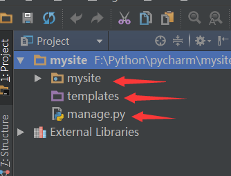

templates目录是html文件存放也就是MTV中的T

manage.py是django项目管理文件

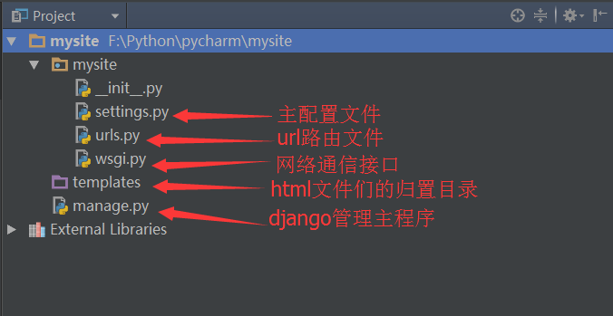

## 3.创建APP

python manage.py startapp cmdb

创建了一个叫做cmdb的APP，django自动生成“cmdb”文件夹

## 4.编写路由

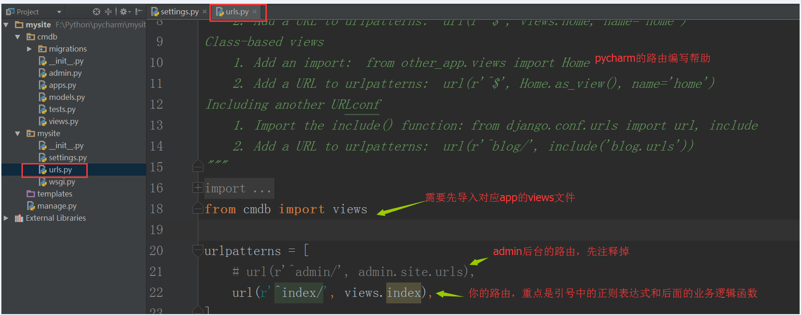

## 5.编写业务处理逻辑

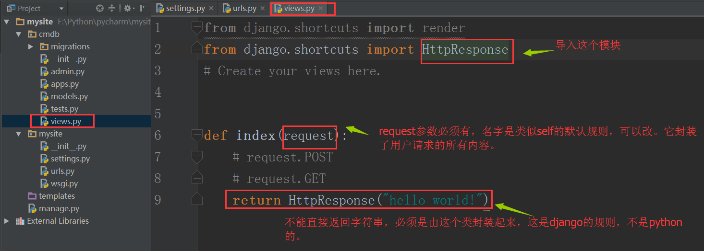

## 6.运行Web服务

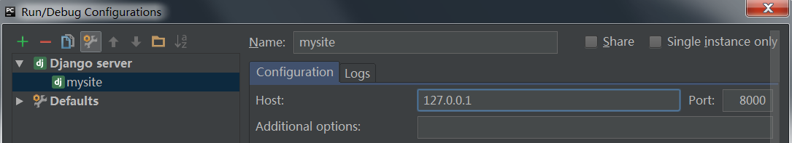

python manage.py runserver 127.0.0.1:8000

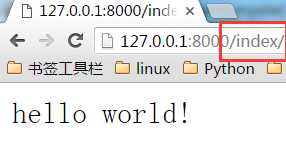

## 7.返回HTML文件

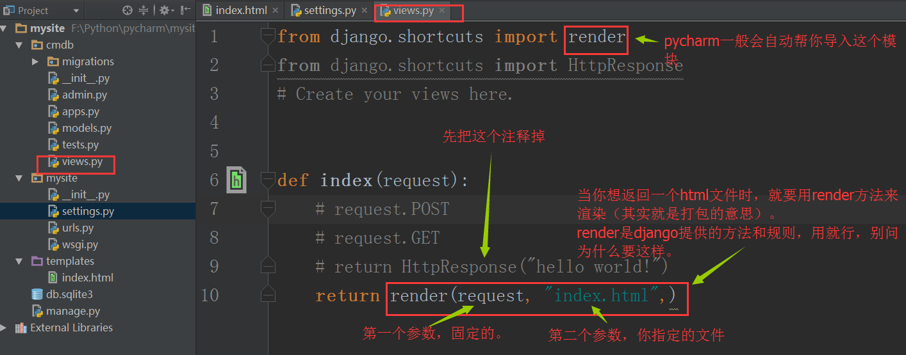

>指定HTML目录
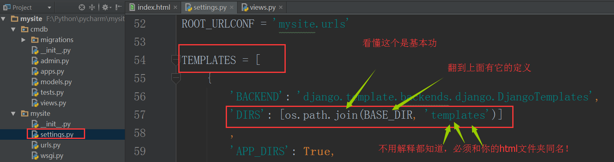
>默认情况下不用修改

## 使用静态文件

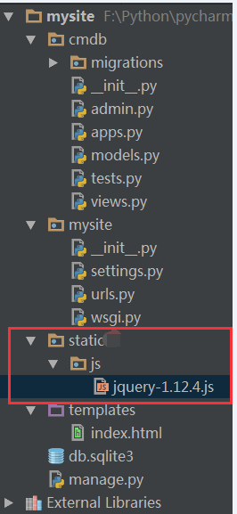
>用于存放CSS,JS和各种插件

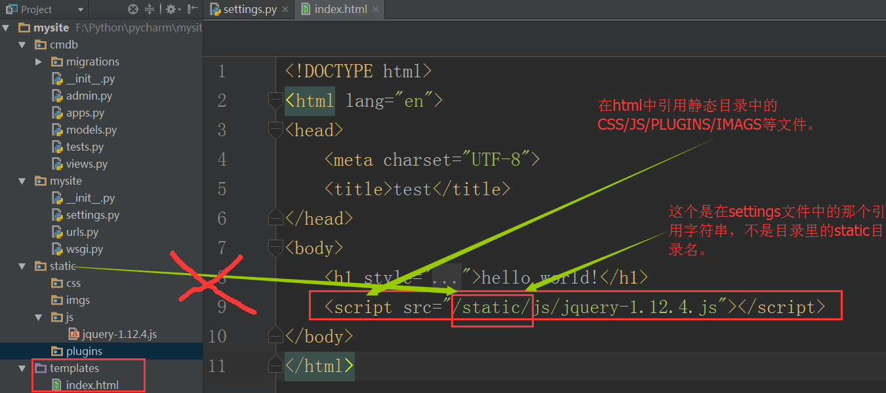

## 9.接收用户发送的数据

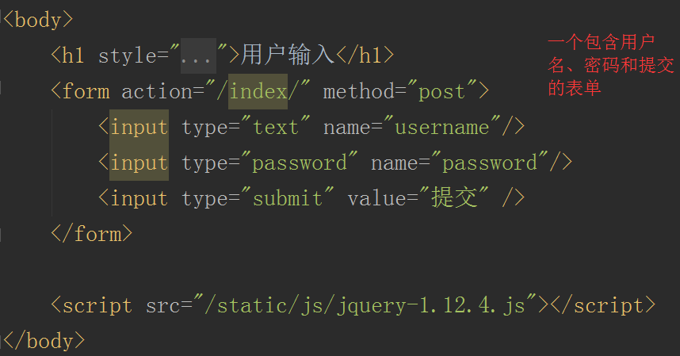

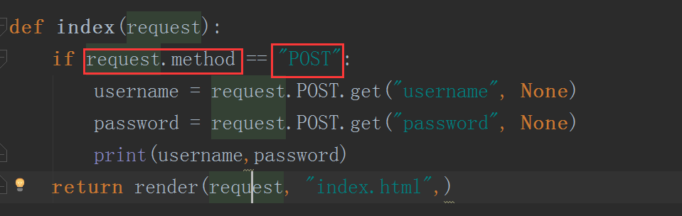

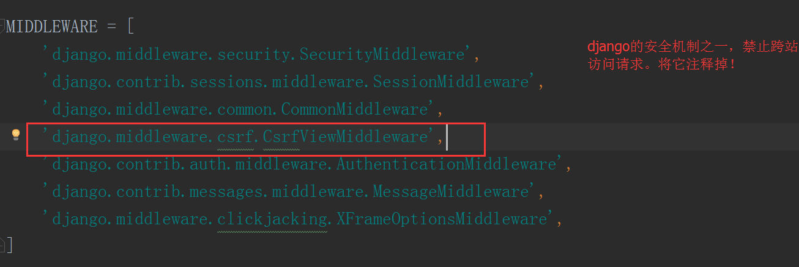

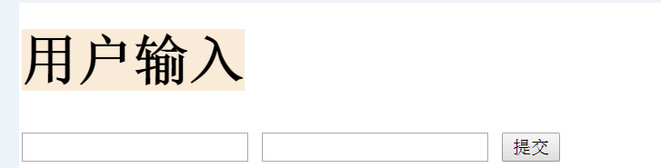

## 10. 返回动态页面

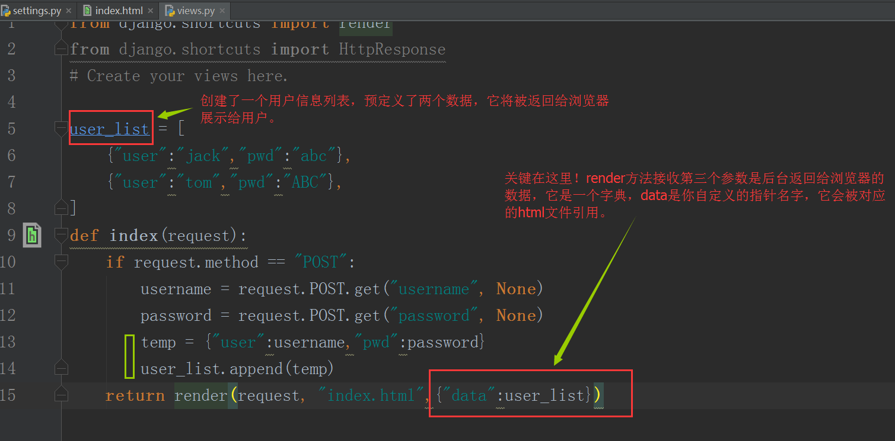

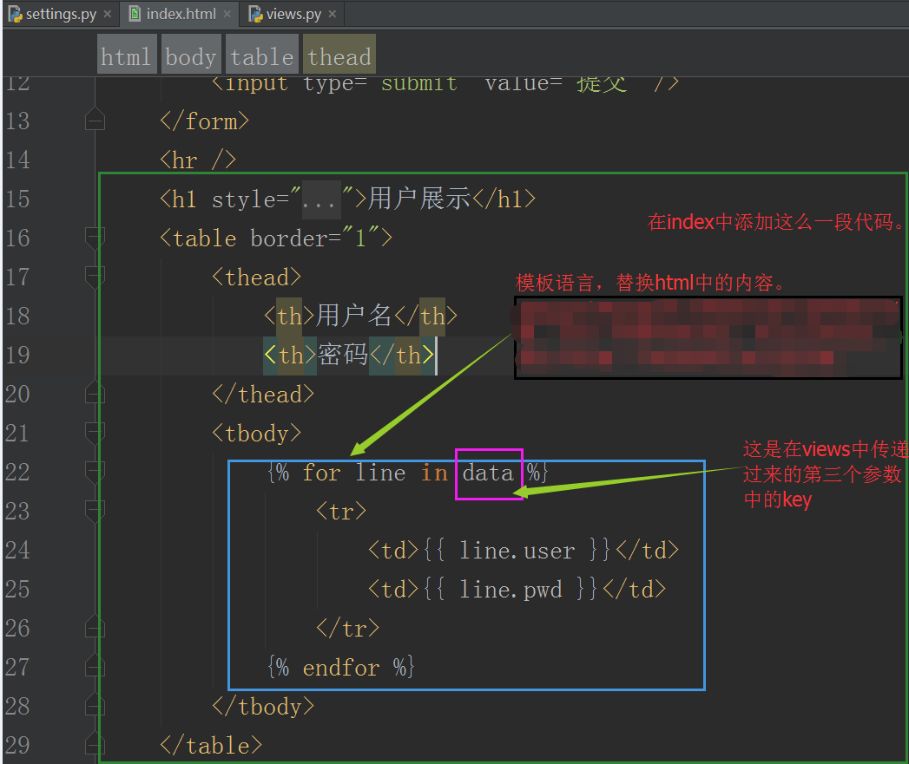

---------------------

